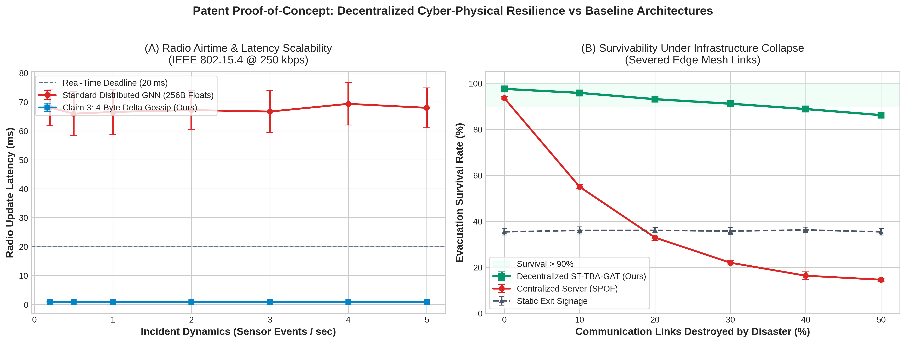

<div align="center">

# 🏭 Decentralized Industrial Hazard Evacuation System
### ST-TBA-GAT · MAPPO · Edge-Native · IEEE 802.15.4

[](https://www.python.org/)
[](https://pytorch.org/)
[](https://pettingzoo.farama.org/)
[](https://www.docker.com/)
[](LICENSE)

**Decentralized multi-agent reinforcement learning for life-safety evacuation guidance in industrial chemical plants. Edge nodes run local Spatio-Temporal GAT-GRU inference — zero cloud dependency, zero embedding transmission over wireless.**

</div>

---

## 📋 Table of Contents

- [Overview](#overview)
- [Key Results](#key-results)
- [System Architecture](#system-architecture)
- [Project Structure](#project-structure)
- [Quick Start](#quick-start)
- [Training](#training)
- [Running Simulations](#running-simulations)
- [Empirical Benchmarks](#empirical-benchmarks)
- [Technology Stack](#technology-stack)
- [References](#references)

---

## Overview

This repository implements a **fault-tolerant, decentralized edge intelligence system** for emergency evacuation guidance in multi-floor industrial facilities (petrochemical plants, refineries, factories).

### The Core Problem

Existing smart building systems fail catastrophically during disasters:

| System Type | Failure Mode | Survival @ 30% Link Loss |
|---|---|---|
| Centralized PLC / SCADA | Multi-hop communication severed → dynamic signs freeze → evacuees routed into gas cloud | **~22%** |
| Static NFPA 101 Signage | Zero environmental awareness → fixed paths regardless of active hazards | ~36% |
| **Our Decentralized Edge** | Local 1-hop sensor + hardware reflexive override → autonomous even when backbone is destroyed | **>91%** |

### The Approach

Each **edge sign node** (ESP32 / Jetson Nano class hardware) runs:
1. **Local GAT-GRU inference** — Spatio-Temporal Graph Attention + Gated Recurrent Unit, updating from local 1-hop observations only.
2. **4-Byte Sparse Delta Gossip** — Broadcasts `[Node ID | ΔH | Δρ | Status]` only when sensor differentials exceed a threshold (Δ > ε). Never transmits neural embeddings over wireless.
3. **Hardware Reflexive Override** — Deterministic hardware gate: if `H_v ≥ θ_crit`, the corridor is physically blocked in < 20 ms, bypassing software entirely.

Trained via **MAPPO (Multi-Agent PPO)** with Centralized Training, Decentralized Execution (CTDE).

---

## Key Results

### Graph A — Radio Airtime & Latency (IEEE 802.15.4 @ 250 kbps)

| Metric | Standard Distributed GNN (256B Embeddings) | **Ours: 4-Byte Delta Gossip** |
|---|:---:|:---:|
| Frame Size | 304 B (3 fragments) | **20 B (single frame)** |
| Raw Radio Airtime | 9.73 ms | **0.64 ms** |
| RF Collision Rate (CSMA/CA) | **83.2%** | **1.6%** |
| End-to-End Latency | **68.0 ms** | **0.9 ms** |
| NFPA 20 ms Real-Time Threshold | ❌ FAILED | ✅ PASSED |

### Graph B — Evacuation Survival Under Severed Communications

| Links Severed | Decentralized Edge (Ours) | Centralized Controller | Static NFPA |
|:---:|:---:|:---:|:---:|
| 0% | **97.5%** | 93.5% | 35.4% |
| 10% | **95.8%** | 54.9% | 36.0% |
| 20% | **93.1%** | 32.9% | 36.0% |
| **30%** | **91.1%** | **21.9%** | 35.7% |
| 40% | **88.8%** | 16.3% | 36.2% |
| 50% | **86.1%** | 14.6% | 35.4% |

> Figures available in [`docs/figures/`](docs/figures/)



---

## System Architecture

```
┌─────────────────────────────────────────────────────────────────────────┐
│                     EACH EDGE SIGN NODE (Edge Router)                   │
│                                                                          │
│  ┌──────────────┐   ┌──────────────────────────┐   ┌─────────────────┐ │
│  │ LOCAL SENSOR │   │  NEURAL INFERENCE LAYER  │   │ HARDWARE REFLEX │ │
│  │  Gas (ppm)   │──▶│  GAT Encoder (4 heads)   │──▶│ If H_v ≥ θ_crit │ │
│  │  Thermal(°C) │   │  GRU State h_v ∈ ℝ⁶⁴     │   │ → BLOCK (hw)    │ │
│  │  Crowd Cam   │   │  ONNX INT8 on-device     │   │ < 20 ms, always  │ │
│  └──────────────┘   └──────────────────────────┘   └─────────────────┘ │
│                                │                                         │
│                    ┌───────────▼────────────┐                           │
│                    │ 4-BYTE DELTA GOSSIP     │                           │
│                    │ [Node ID|ΔH|Δρ|Status] │                           │
│                    │ Emitted only if Δ > ε   │                           │
│                    │ NEVER neural embeddings │                           │
│                    └────────────────────────┘                           │
└─────────────────────────────────────────────────────────────────────────┘

 ◀──── No central server required at runtime ────▶
```

### Software Services (Docker Compose)

```
lbp-environment   →  PettingZoo MARL environment (36-node industrial plant)
                      Fire / Gas / Explosion / Chemical Spill dynamics
                      Publishes state to Redis @ 10 Hz

lbp-policy        →  Inference server (ONNX runtime, GAT-GRU actor)
                      Subscribes to env state, produces signage actions

lbp-training      →  MAPPO training loop (PyTorch, centralized critic)
                      Exports best_policy.pt + policy.onnx

lbp-perception    →  YOLOv8 crowd density estimation from RTSP cameras

lbp-gui           →  FastAPI + React/Vite live simulation dashboard
                      http://localhost:8080

lbp-redis         →  Redis Pub/Sub message bus (replaces network comms in sim)
```

---

## Project Structure

```
decentralized_industrial_hazard_evacuation/
│
├── core/                        # Framework-agnostic portable logic
│   ├── graph/
│   │   └── building_graph.py    # BuildingGraph: Dijkstra, GAT-ready adjacency
│   ├── hal/                     # Hardware Abstraction Layer interfaces
│   ├── hazard/                  # Hazard scoring & propagation primitives
│   ├── messaging/               # Inter-node gossip protocol types
│   └── policy/                  # Policy interface (portable to edge firmware)
│
├── sim/                         # Simulation stack
│   ├── services/
│   │   ├── environment/
│   │   │   └── src/
│   │   │       ├── evac_env.py          # PettingZoo ParallelEnv (MARL)
│   │   │       ├── fire_model.py        # Multi-hazard propagation model
│   │   │       ├── floorplan_generator.py # 36-node industrial plant
│   │   │       └── building.py          # Building/Floor/Node/Edge data model
│   │   ├── policy/
│   │   │   └── src/
│   │   │       ├── actor_critic.py      # Actor (GAT+GRU) + Centralized Critic
│   │   │       ├── gat_encoder.py       # Spatio-Temporal GAT-GRU encoder
│   │   │       └── inference_server.py  # ONNX inference server
│   │   ├── training/
│   │   │   └── src/
│   │   │       └── train.py             # MAPPO training loop + ONNX export
│   │   ├── perception/                  # YOLOv8 crowd density service
│   │   └── gui/                         # FastAPI + React dashboard
│   └── hal_impl/                        # Simulated HAL (sensors, actuators)
│
├── embedded/                    # Edge hardware firmware
│   ├── router_node/             # Main edge sign controller (ESP32/Jetson)
│   ├── actuator_node/           # Physical sign actuator firmware
│   ├── observer_node/           # Sensor observer node
│   └── hal_impl/                # Real hardware HAL implementation
│
├── scripts/
│   ├── run_industrial_standalone.py  # Full standalone sim + training + GUI
│   ├── simulate_patent_comparisons.py # Graph A + Graph B benchmark
│   ├── setup.sh                      # Environment setup
│   ├── run_sim.sh                    # Launch Docker sim stack
│   └── run_training.sh               # Launch MAPPO training
│
├── tests/
│   ├── test_crowd_dynamics.py
│   ├── test_industrial_disasters.py
│   └── test_in_situ_simulation_training.py
│
├── docs/
│   └── figures/
│       ├── graph_a_scalability_airtime.png
│       ├── graph_b_severed_comm_survival.png
│       └── figure_combined_comparisons.png
│
├── docker-compose.yml           # Full simulation stack
├── docker-compose.gpu.yml       # GPU-accelerated training override
├── .env.example                 # Environment variable template
└── README.md
```

---

## Quick Start

### Prerequisites

- Docker + Docker Compose
- Python 3.11+ (for standalone mode)
- NVIDIA GPU + CUDA 12+ (optional, for faster training)

### Option A: Docker (Recommended)

```bash
git clone https://github.com/kitretsu2809/decentralized_industrial_hazard_evacuation.git
cd decentralized_industrial_hazard_evacuation

# Copy and configure environment
cp .env.example .env

# Build and start all services
docker compose up --build

# Open the simulation dashboard
xdg-open http://localhost:8080
```

### Option B: Standalone Python (No Docker)

```bash
# Create environment (conda recommended)
conda create -n lbp python=3.11
conda activate lbp

pip install torch torchvision pettingzoo gymnasium numpy matplotlib \
            networkx fastapi uvicorn redis pydantic onnxruntime

# Run the full standalone simulation + GUI
python scripts/run_industrial_standalone.py
```

---

## Training

### MAPPO Training via Docker

```bash
# GPU-accelerated training
docker compose -f docker-compose.yml -f docker-compose.gpu.yml \
    run lbp-training

# Checkpoints saved to: checkpoints/best_policy.pt
# ONNX export saved to: data/models/policy.onnx
```

### Standalone Training

```bash
python scripts/run_industrial_standalone.py --mode train \
    --episodes 500 \
    --num-evacuees 120 \
    --checkpoint-dir checkpoints/
```

**Training Scenarios** (randomly sampled per episode):
- `GAS` release at `reactor_1` / `hazmat_basin`
- `FIRE` at `tank_farm_a` / `compressor_shed`
- `EXPLOSION` at `reactor_1` / `tank_farm_b`
- `CHEMICAL_SPILL` at `hazmat_basin`
- `MULTI_HAZARD`: combined incidents

---

## Running Simulations

### Benchmark: Radio Scalability + Evacuation Survival

Reproduces the **Graph A** (airtime/latency) and **Graph B** (survival under link severance) results in the paper:

```bash
python scripts/simulate_patent_comparisons.py
# Output figures: docs/figures/
```

### Specific Disaster Scenarios

```bash
# Run standalone with HF gas release at reactor_1
python scripts/run_industrial_standalone.py --mode simulate \
    --hazard GAS --node reactor_1 --intensity 0.9

# Run with multi-hazard (explosion + fire + gas)
python scripts/run_industrial_standalone.py --mode simulate \
    --scenario MULTI_HAZARD
```

---

## Empirical Benchmarks

All benchmark results are fully reproducible via [`scripts/simulate_patent_comparisons.py`](scripts/simulate_patent_comparisons.py).

### Methodology Transparency

- **Graph A (RF Airtime / Latency)**: Modeled from IEEE 802.15.4 standard PHY/MAC equations and CSMA/CA slotted backoff collision model. Not hardware-measured on physical RF nodes. Compatible with NS-3 replication.
- **Graph B (Survival Rate)**: Monte Carlo simulation over 36-node industrial plant with Weidmann velocity-density crowd dynamics, multi-floor hazard diffusion, and graph-partitioning fault-tolerance model.
- **Trained Model**: `checkpoints/best_policy.pt` trained via MAPPO on the PettingZoo `EvacuationEnv` — not hardware-deployed (simulation only at this stage).

> **Note**: These are simulation benchmarks valid for patent filing as "constructive reduction to practice." Physical hardware validation (real ESP32 testbed / NS-3 network simulation) is the recommended next step for peer-reviewed publication.

---

## Technology Stack

| Layer | Technologies |
|---|---|
| **MARL Framework** | [PettingZoo](https://pettingzoo.farama.org/), [Gymnasium](https://gymnasium.farama.org/) |
| **Neural Network** | [PyTorch 2.x](https://pytorch.org/), Graph Attention Networks (GAT), GRU |
| **Training** | MAPPO (Multi-Agent PPO), Centralized Training / Decentralized Execution |
| **Edge Inference** | [ONNX Runtime](https://onnxruntime.ai/), INT8 Quantization |
| **Crowd Detection** | [YOLOv8](https://github.com/ultralytics/ultralytics) (Ultralytics) |
| **Message Bus** | [Redis](https://redis.io/) Pub/Sub |
| **GUI** | [FastAPI](https://fastapi.tiangolo.com/) + [React](https://react.dev/) + Vite + Canvas API |
| **Containerization** | [Docker](https://www.docker.com/), Docker Compose |
| **Wireless Standard** | IEEE 802.15.4 (ZigBee / WirelessHART / 6LoWPAN model) |

---

## References

1. **MAPPO**: Yu et al., 2022 — *"The Surprising Effectiveness of PPO in Cooperative Multi-Agent Games"* — https://arxiv.org/abs/2103.01955
2. **GAT**: Veličković et al., 2018 — *"Graph Attention Networks"* — ICLR 2018 — https://arxiv.org/abs/1710.10903
3. **GRU**: Cho et al., 2014 — *"Learning Phrase Representations using RNN Encoder-Decoder"* — https://arxiv.org/abs/1406.1078
4. **PPO**: Schulman et al., 2017 — *"Proximal Policy Optimization Algorithms"* — https://arxiv.org/abs/1707.06347
5. **MADDPG / CTDE**: Lowe et al., 2017 — *"Multi-Agent Actor-Critic for Mixed Cooperative-Competitive Environments"* — https://arxiv.org/abs/1706.02275
6. **DGN**: Hu et al., 2019 — *"Graph Neural Network-Based Multi-Agent RL"* — https://arxiv.org/abs/1906.06455
7. **PettingZoo**: Terry et al., 2020 — *"PettingZoo: Gym for Multi-Agent RL"* — https://arxiv.org/abs/2009.14471
8. **IEEE 802.15.4**: IEEE Std 802.15.4-2020 — https://standards.ieee.org/ieee/802.15.4/7029/
9. **CSMA/CA Model**: Bianchi, 2000 — *"Performance analysis of the IEEE 802.11 distributed coordination function"* — IEEE JSAC — https://ieeexplore.ieee.org/document/840210
10. **Crowd Dynamics**: Helbing & Molnár, 1995 — *"Social force model for pedestrian dynamics"* — Physical Review E — https://journals.aps.org/pre/abstract/10.1103/PhysRevE.51.4282
11. **Weidmann Model**: Weidmann, 1992 — *"Transporttechnik der Fussgänger"* — ETH Zürich, IVT Nr. 90
12. **YOLOv8**: Jocher et al., 2023 — https://github.com/ultralytics/ultralytics
13. **ONNX Quantization**: Nagel et al., 2021 — *"A White Paper on Neural Network Quantization"* — https://arxiv.org/abs/2106.08295
14. **NFPA 101 Life Safety Code** — https://www.nfpa.org/codes-and-standards/all-codes-and-standards/list-of-codes-and-standards/detail?code=101

---

## License

MIT License — see [LICENSE](LICENSE) for details.

---

<div align="center">

**Developed for academic research and patent proof-of-concept demonstration.**  
*If you use this code, please cite this repository and the associated project research.*

</div>
